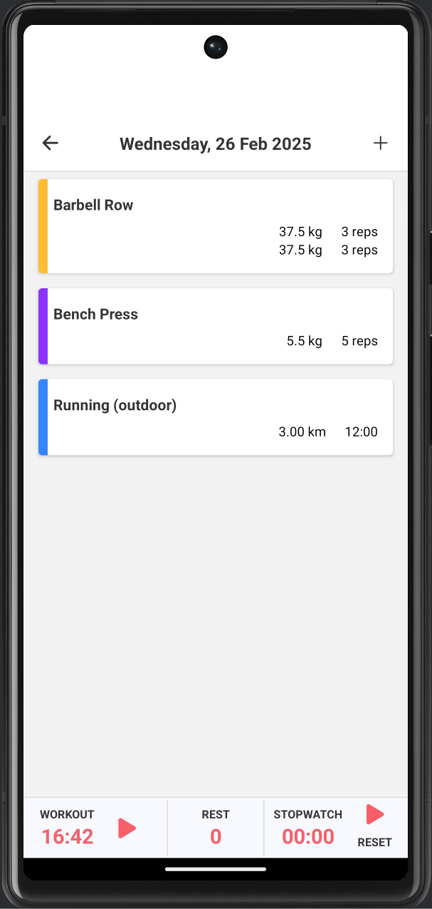
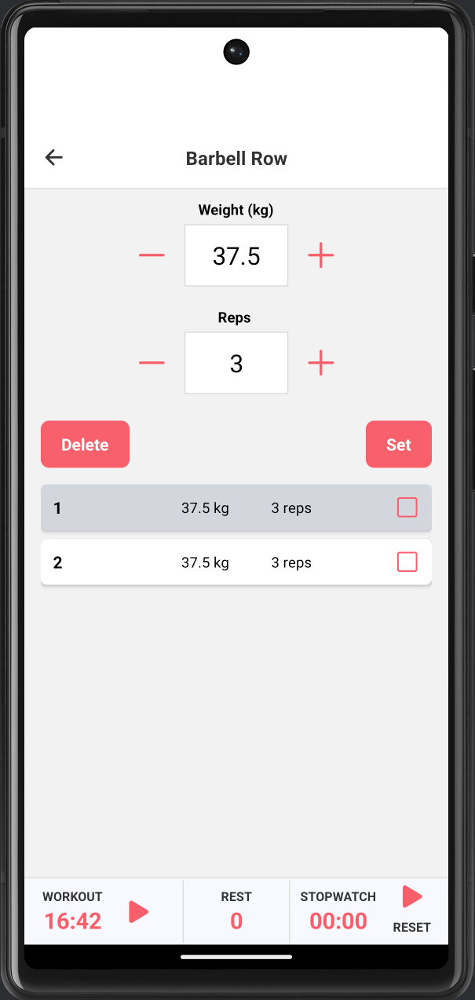
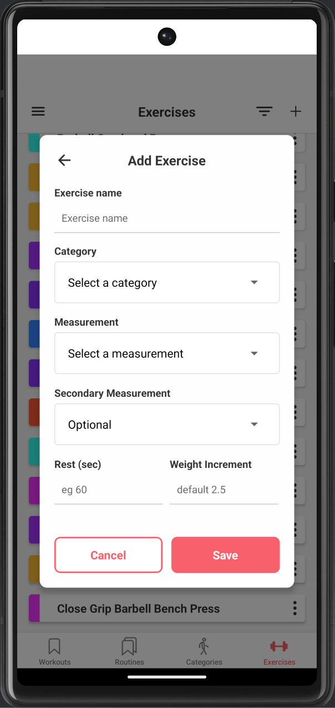

# 🏋️‍♂️ RepRealm

RepRealm is a **workout tracking app** that allows users to **create and log workouts, and track progress**.

## 📌 Features

### **📱 Mobile App (React Native + Expo)**
- **Workout Logging**: Start, stop, and track workouts.
- **Exercise Tracking**: Organise exercises by categories, set reps, weights, and track history.
- **Offline Support**: Data is stored locally, syncing will be added in a future update.
- **Customisation**:
  - Users can manually set start/end times for workouts.
  - Add and edit exercises and categories.

### **🌐 API (NestJS, PostgreSQL, GraphQL)**
- **User Authentication** (Sign up, log in).

---

## 🚀 Download & Install

You can **download the latest version** of RepRealm here:
🔗 **[Download RepRealm APK](https://expo.dev/accounts/dominicsp/projects/RepRealm/builds/39db731d-6c12-40aa-b595-48a7f8cc48e2)**

### **📱 How to Install (Android)**
1. Click the **Download APK** button above.
2. Open the downloaded file on your phone.
3. If prompted, **enable "Install Unknown Apps"** for your browser.
4. Tap **Install** and wait for it to complete.
5. Open the app and start tracking your workouts! 🎉

---

## 📱 Screenshots

**Workout Screen**

**Active Exercise Screen**

**Create Exercise Screen**

---

## 🏗️ Future Plans
- **Workout Syncing**: Sync data to the cloud.
- **Progress Charts**: Visualise strength and endurance improvements.
- **Dark Mode**: UI theme support.

---

## 👨‍💻 Contributors
- **Dominic Spinks** - Developer

If you encounter any issues, feel free to open an **issue** or submit a **pull request**.

---
© 2025 RepRealm. All rights reserved.