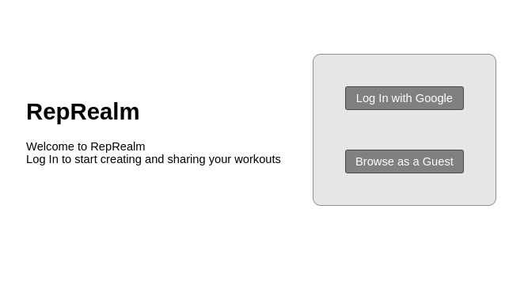
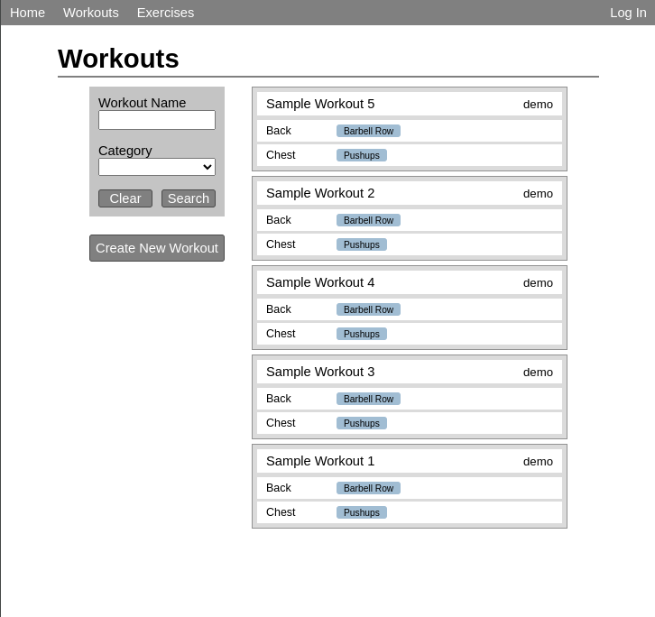

# RepRealm

RepRealm is a web application for creating and storing your custom workout routines.

Users can browse through the repository of other user's shared workouts, saving those they like to perform for themselves.

## Background

The inspiration for RepRealm came from one simple question: how do I share this new workout routine I have created with my friends?

## Screenshots

 

## Technologies

-   Node.js
-   Express
-   MongoDB and Mongoose
-   HTML/CSS
-   JavaScript

## Getting Started

Try out [RepRealm](https://reprealm.onrender.com/) for yourself!

Additionally, you can explore the project planning on [Trello](https://trello.com/b/E76NoRHh/sei-project-2).

## Next Steps

The vision for RepRealm is to be a complete solution for your workout tracking needs. The following enhancements are planned:

-   Allow users to save workouts created by other users
-   Perform and record a workout in the user's profile
    -   This include reporting and visualisation of the user's progress with particular workouts/exercises
-   Optimise for mobile
    -   Users will typically not have access to a computer to record their workouts, so optimisation for mobile is essential
-   Allow users to create Routines
    -   Routines are a set of workouts that form part of a typical training plan
